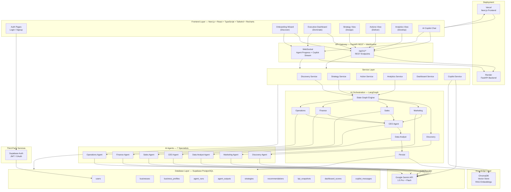
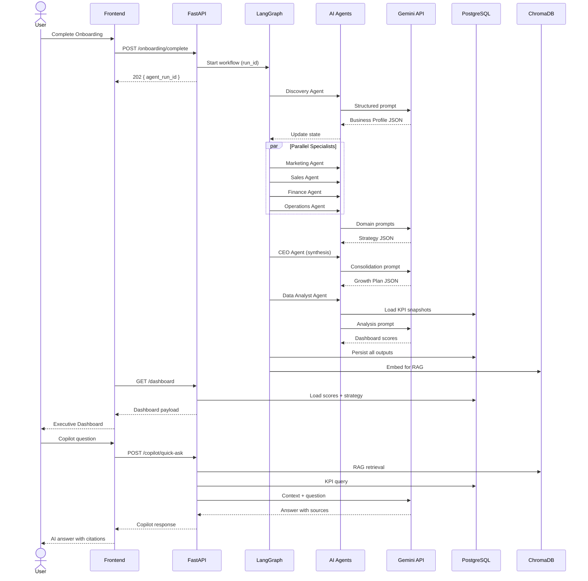
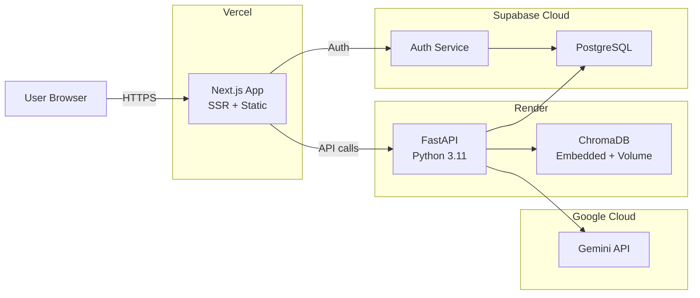

# One-Page Architecture Diagram

> Complete system view: Frontend → Backend → AI Layer → Knowledge Layer → Database → Dashboard

---

## System Architecture (Single View)



---

## Layer Summary

| Layer | Technology | Responsibility |
|-------|------------|----------------|
| **Frontend** | Next.js, React, TypeScript, Tailwind, Recharts | UI for 5D lifecycle + Copilot |
| **API Gateway** | FastAPI, WebSocket | REST endpoints, auth, async jobs |
| **Service Layer** | Python services | Business logic, use cases |
| **AI Orchestration** | LangGraph | Agent pipeline state machine |
| **AI Agents** | 7 specialist agents | Domain-specific LLM reasoning |
| **LLM** | Google Gemini 1.5 Pro/Flash | Language model inference |
| **Knowledge Layer** | ChromaDB | Vector embeddings for RAG |
| **Database** | PostgreSQL (Supabase) | Structured data, auth, RLS |
| **Deployment** | Vercel + Render | Production hosting |

---

## Data Flow (Business Lifecycle)



---

## Deployment Architecture



---

## Tech Stack Reference

```
┌─────────────────────────────────────────────────────────────────────────┐
│                         BUSINESS GROWTH OS                              │
├─────────────────────────────────────────────────────────────────────────┤
│  FRONTEND          │  Next.js 14 · React 18 · TypeScript · Tailwind    │
│                    │  Recharts · TanStack Query · Supabase JS           │
├────────────────────┼────────────────────────────────────────────────────┤
│  BACKEND           │  FastAPI · Python 3.11 · Pydantic v2 · SQLAlchemy │
│                    │  Alembic · WebSocket · BackgroundTasks             │
├────────────────────┼────────────────────────────────────────────────────┤
│  AI LAYER          │  LangGraph · 7 Custom Agents · Prompt Templates   │
│                    │  Google Gemini 1.5 Pro / Flash                     │
├────────────────────┼────────────────────────────────────────────────────┤
│  KNOWLEDGE LAYER   │  ChromaDB (embedded) · RAG · Embedding Service    │
├────────────────────┼────────────────────────────────────────────────────┤
│  DATABASE          │  PostgreSQL (Supabase) · Row-Level Security       │
│                    │  Supabase Auth (JWT)                               │
├────────────────────┼────────────────────────────────────────────────────┤
│  DEPLOYMENT        │  Vercel (frontend) · Render (backend + ChromaDB)  │
├────────────────────┼────────────────────────────────────────────────────┤
│  THIRD-PARTY       │  Google Gemini API · Supabase (Auth + DB)         │
└─────────────────────────────────────────────────────────────────────────┘
```

---

## 5D Framework → System Mapping

| 5D Phase | Frontend Route | API Endpoints | Agents | DB Tables |
|----------|---------------|---------------|--------|-----------|
| **Discover** | `/onboarding/*` | `/onboarding`, `/profile` | Discovery | business_profiles |
| **Design** | `/strategy` | `/analyze`, `/strategy` | Marketing, Sales, Finance, Ops, CEO | strategies, agent_outputs |
| **Deliver** | `/actions` | `/recommendations`, `/campaigns` | Marketing, Sales, Ops | recommendations, campaigns |
| **Develop** | `/analytics` | `/kpis`, `/performance` | Data Analyst | kpi_snapshots, performance_comparisons |
| **Dominate** | `/` (dashboard) | `/dashboard` | Data Analyst | dashboard_scores |
| **Copilot** | `/copilot` | `/copilot/*` | RAG over all outputs | copilot_messages |

---

## Agent Execution Flow

```
User Action                    LangGraph Pipeline                 Output
───────────                    ──────────────────                 ──────

Onboarding Complete ──────►  [Discovery]  ──────────────────►  Business Profile
                                    │
Full Analysis Request ────►  [Marketing ]──┐
                             [Sales     ]──┤
                             [Finance   ]──┼──► [CEO] ──► [Analyst] ──► Dashboard
                             [Operations]──┘
                                    │
KPI Update ───────────────►  [Analyst]  ──────────────────►  Updated Scores
                                    │
Copilot Question ─────────►  RAG Query (ChromaDB + PG) ────►  Contextual Answer
```
